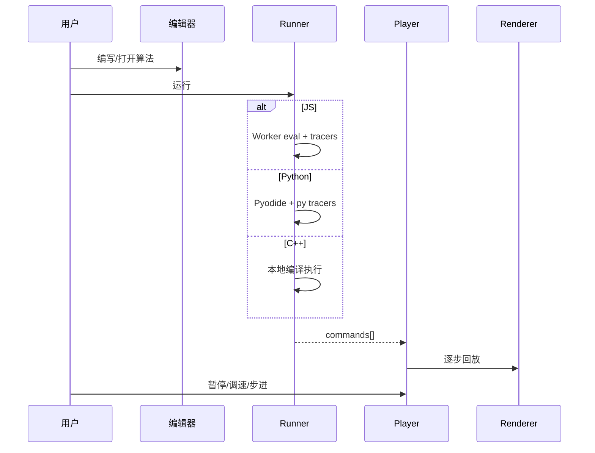
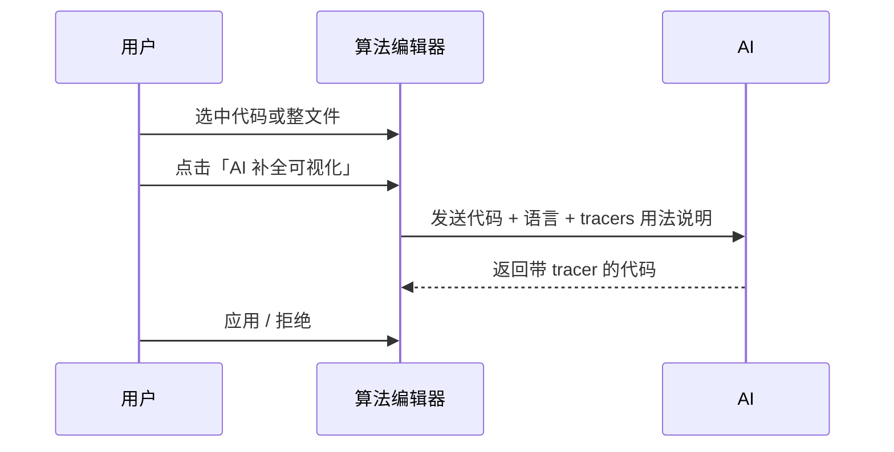

# 个人工作台 · 详细设计文档

> 版本：v1.2  
> 日期：2026-09-14  
> 状态：已实现双主题（明/暗）与 Radial Theme Transition；对齐 ui-ux-pro-max + advanced-interaction-design

---

## 1. 产品定位

**Worktable** 是一个本地优先的个人学习工作台，把三件事装进同一套外壳：

1. **教程学习** — 分步教程阅读器（兼容 `uredis-tutorial` 的 Step 模型），支持章节备注
2. **算法实验室** — 算法编写、运行、可视化（完整移植 Algorithm Visualizer 能力，中文 UI）
3. **AI 助手** — OpenAI 兼容接口，用于教程解答、生成教程步骤、生成可视化代码

### 1.1 目标用户

个人开发者 / 学习者，单机使用，数据默认落在浏览器 IndexedDB，可导出。

### 1.2 非目标（v1 不做）

- 多用户 / 账号体系 / 云端同步
- 移动端优先适配（保证桌面可用即可）
- 严格原样 fork 官方 CRA 老栈（见 §3 决策）

---

## 2. 关键决策记录

| 决策点 | 选择 | 理由 |
|--------|------|------|
| 前端栈 | React 18 + TypeScript + Vite | 用户指定；与 AV 生态同栈 |
| AV 集成 | 现代重建外壳 + 完整移植 AV 能力 | 官方 React16+CRA+node-sass 无法在 Node22 可靠运行 |
| 语言支持 | JS / Python / C++ | 用户指定；官方仅有 JS/C++/Java |
| JS 运行 | Web Worker + `algorithm-visualizer`（tracers） | 与官方 worker 协议一致，零后端 |
| Python 运行 | Pyodide（浏览器） | 个人本机无需 Docker |
| C++ 运行 | 优先本机 `g++`/`clang++`，无则引导安装 | 用户指定；Docker 作可选后备 |
| AI | OpenAI 兼容 API，界面配置 baseURL/key/model | 可接 DeepSeek/通义/Kimi/Ollama |
| 存储 | IndexedDB + 可选 JSON 导出/导入 | 本地优先、可迁移 |
| 教程格式 | 兼容 `uredis-tutorial` 的 `Step[]` | 可直接导入现有教程 |
| UI/视觉 | `frontend-design` Convention 模式 + §7.2 令牌 | 工具型产品，熟悉即质量 |
| 高级交互 | `advanced-interaction-design` 按 §7.4 选型 | 先任务后动画，禁止无意义动效 |

---

## 3. 技术栈

### 3.1 前端

```
react@18
react-dom@18
react-router-dom@6
typescript@5
vite@5
zustand                    # 轻量状态（替代 Redux）
@codemirror/*              # 代码编辑器（替代 Ace）
idb                        # IndexedDB 封装
algorithm-visualizer       # tracers 可视化协议库（JS）
pyodide                    # Python 运行时（懒加载）
```

### 3.2 本地可选后端（仅 C++）

```
express / fastify          # 极简 API
child_process              # 调用 g++/clang++ 编译运行
```

> v1 前端可独立跑通 JS+Python+教程+AI；C++ 依赖本地编译器检测。

### 3.3 工程结构（monorepo 可选，v1 单包）

```
worktable/
  package.json
  vite.config.ts
  index.html
  DESIGN.md
  docs/
  vendor/                          # 只读参考，不参与构建
    algorithm-visualizer/
    server/
  public/
    tutorials/                     # 预置教程静态资源
  src/
    main.tsx
    App.tsx
    routes/
    layouts/
      AppShell.tsx
    modules/
      tutorials/                   # 教程
      algorithms/                  # 算法实验室
      ai/                          # AI
      settings/
    core/
      av/                          # AV 可视化移植层
        tracers/
        renderers/
        player/
        commander.ts
      runners/                     # 语言运行时
        js/
        python/
        cpp/
      storage/                     # IndexedDB
      i18n/
    components/
    styles/
    types/
  server-cpp/                      # 可选：C++ 本地编译服务
```

---

## 4. 信息架构与路由

| 路由 | 页面 | 说明 |
|------|------|------|
| `/` | 概览 | 最近教程、最近算法、快捷入口 |
| `/tutorials` | 教程库 | 已导入/预置教程列表 |
| `/tutorials/:id` | 教程学习 | 分步阅读 + 备注 |
| `/algorithms` | 算法库 | 分类树 + 搜索 + 收藏 |
| `/algorithms/editor` | 草稿编辑器 | 未保存/新建 |
| `/algorithms/:id` | 算法详情 | 编辑 + 运行 + 可视化 |
| `/ai` | AI 助手 | 对话；可从教程/算法跳入并带上下文 |
| `/settings` | 设置 | AI API、C++ 编译器路径、数据导入导出 |

侧栏固定：**概览 / 教程 / 算法 / AI / 设置**

---

## 5. 模块详细设计

### 5.1 教程模块

#### 5.1.1 数据模型（兼容 uredis-tutorial）

```ts
// types/tutorial.ts
export type DiffLineType = 'a' | 'r' | 'c' // added / removed / context

export interface DiffLine {
  t: DiffLineType
  c: string
}

export interface TutorialStep {
  title: string
  message: string                    // HTML
  changed: string[]
  diffs: Record<string, DiffLine[]>
  files: Record<string, string>
}

export interface TutorialMeta {
  id: string
  title: string
  description?: string
  author?: string
  tags: string[]
  source?: string                    // 来源路径或 URL
  stepCount: number
  createdAt: number
  updatedAt: number
  progress: {
    lastStep: number
    completedSteps: number[]         // 可选手动标记完成
  }
}

export interface Tutorial extends TutorialMeta {
  steps: TutorialStep[]
}

export interface TutorialNote {
  id: string                         // `${tutorialId}:${stepIndex}`
  tutorialId: string
  stepIndex: number
  content: string                    // Markdown 或纯文本
  updatedAt: number
}
```

#### 5.1.2 导入方式

1. **预置**：把 `uredis-tutorial` 的 `steps.ts` 转成 `public/tutorials/uring-redis.json`（构建时脚本转换一次）
2. **导入 JSON**：设置/教程库支持上传符合 `Tutorial` 结构的 JSON
3. **文件夹约定（后续）**：`tutorials/<id>/meta.json` + `steps.json`

#### 5.1.3 学习页布局

```
┌─────────────┬──────────────────────┬──────────────┐
│ 步骤列表     │ 讲解内容 (HTML)       │ Diff / 文件   │
│ (可折叠)     │ + 备注编辑器          │ (可切换)      │
├─────────────┴──────────────────────┴──────────────┤
│ 上一步 · 步骤 x/N · 下一步 · 跳转                   │
└───────────────────────────────────────────────────┘
```

- 复用 uredis-tutorial 的交互：点文件名查看全文；diff 高亮增删
- **备注**：右侧或底部抽屉；按步骤自动保存（防抖 500ms）
- **进度**：进入步骤即更新 `lastStep`

#### 5.1.4 备注与 AI 联动

- 备注区提供「问 AI」按钮 → 跳转 `/ai`，注入：
  - 教程标题 + 当前步骤 title + message 截断 + 用户备注
- AI 页可「回到该步骤」

---

### 5.2 算法实验室（AV 移植）

#### 5.2.1 能力来源

从官方 AV 移植并中文化的子集：

| 官方模块 | 移植目标 | 说明 |
|----------|----------|------|
| `core/tracers` | `core/av/tracers` | 命令收集与协议 |
| `core/renderers` | `core/av/renderers` | Array1D/2D、Graph、Chart、Log、Markdown |
| `core/layouts` | `core/av/player` | 播放器时序 |
| `components/Navigator` | `algorithms/Navigator` | 分类树，文案中文化 |
| `components/CodeEditor` | CodeMirror 6 | 替换 Ace |
| `components/VisualizationViewer` | `algorithms/VizPanel` | 可视化区 |
| `components/Player` | `algorithms/PlayerBar` | 播放/暂停/步进/速度 |
| `files/skeletons` | `core/runners/skeletons` | JS/Python/C++ 骨架 |
| GitHub Gist 保存 | 本地 IndexedDB | 个人工作台不需要 Gist |

**不移植**：GitHub OAuth、官方 online algorithms 仓库强依赖、Docker Java。

#### 5.2.2 可视化命令协议

JS 路径与官方一致：

```
用户代码 (Worker)
  require('algorithm-visualizer')
  Tracer.delay() 自动注入行号
  → Commander.commands[]
  → postMessage
主线程 Player 回放 commands
  → 更新 tracer 状态
  → Renderer 重绘
```

Worker 实现参考官方 `worker.js`：

```js
// 伪代码
importScripts('/av-tracers.umd.js') // 本地打包 tracers，不依赖 unpkg
const sandbox = (code) => {
  const require = (name) => ({ 'algorithm-visualizer': AlgorithmVisualizer }[name])
  eval(code)
}
onmessage = (e) => {
  const lines = e.data.split('\n')
    .map((line, i) => line.replace(/(\.\s*delay\s*)\(\s*\)/g, `$1(${i})`))
  sandbox(lines.join('\n'))
  postMessage(AlgorithmVisualizer.Commander.commands)
}
```

#### 5.2.3 语言运行时

| 语言 | 执行方式 | 可视化命令收集 |
|------|----------|----------------|
| JavaScript | Web Worker + 本地 tracers UMD | 原生 |
| Python | Pyodide 沙箱 | 自实现薄封装 `algorithm_visualizer` 模块，输出同样 commands JSON |
| C++ | 本地编译运行 | 链接/嵌入 tracers C++ 头文件实现，stdout 输出 JSON commands |

**Python 方案细节**

```python
# 用户代码风格对齐 tracers.py / 官方算法仓库
from algorithm_visualizer import Array1DTracer, Tracer, visualize

arr = [5, 2, 9, 1]
tracer = Array1DTracer('数组')
tracer.set(arr)
Tracer.delay()
arr[0], arr[3] = arr[3], arr[0]
tracer.set(arr)
visualize()
```

实现：在 Pyodide 环境注入纯 Python 版 `algorithm_visualizer`，`visualize()` 把累积的 commands 交给主线程。

**C++ 方案细节**

1. `settings` 里配置编译器路径（默认探测 `g++`、`clang++`、`cl`）
2. 工作台将用户 `.cpp` + 内嵌 header-only tracers 写入临时目录
3. 编译执行；stdout 约定输出：
   ```json
   {"type":"commands","commands":[...]}
   ```
4. 无编译器时：编辑器可写，运行按钮显示「未检测到 C++ 编译器」

```ts
interface RunnerResult {
  ok: boolean
  language: 'js' | 'python' | 'cpp'
  commands?: AvCommand[]
  stdout?: string
  stderr?: string
  durationMs: number
  error?: string
}
```

#### 5.2.4 算法库数据模型

```ts
export type AlgoLanguage = 'javascript' | 'python' | 'cpp'

export interface AlgorithmMeta {
  id: string
  title: string
  description?: string
  language: AlgoLanguage
  category: string           // 如 'sorting' | 'graph' | 自定义
  tags: string[]
  favorite: boolean
  createdAt: number
  updatedAt: number
  lastRunAt?: number
  source: 'builtin' | 'user'
}

export interface AlgorithmFile {
  name: string               // e.g. 'quick_sort.js'
  content: string
}

export interface Algorithm extends AlgorithmMeta {
  files: AlgorithmFile[]     // v1 单文件即可，结构预留多文件
}
```

分类：

- 内置分类（中文）：排序、搜索、图论、树、动态规划、数学、字符串、其他
- 用户可自定义分类（字符串）

预置算法（内置只读副本，可「另存为我的算法」）：

- 冒泡排序 / 快速排序 / 二分查找 / BFS / DFS 等（JS 版，带 tracer）

#### 5.2.5 算法编辑页布局

```
┌──────────┬─────────────────────┬────────────────────┐
│ 分类导航   │   可视化画布          │  代码编辑器          │
│ 搜索      │   (renderers)        │  (CodeMirror)      │
│ 我的/内置  ├─────────────────────┤                    │
│          │   播放条              │  运行 / 保存          │
└──────────┴─────────────────────┴────────────────────┘
```

交互：

- 运行 → 跑 runner → commands → 自动从头播放
- 播放条：播放/暂停/上一步/下一步/速度 0.25x–4x
- 保存：写入 IndexedDB，可改分类/标签/收藏
- 「AI 可视化」：把当前代码发给 AI，请求补全 tracer 调用

---

### 5.3 AI 模块

#### 5.3.1 配置

```ts
export interface AiSettings {
  baseUrl: string            // 例如 https://api.deepseek.com/v1
  apiKey: string
  model: string              // 例如 deepseek-chat
  temperature?: number
  maxTokens?: number
}
```

- 设置页填写；`apiKey` 仅存 `localStorage`（key: `worktable.ai`）
- 连接测试按钮：发一条 `ping` 消息

#### 5.3.2 功能

| 功能 | 入口 | System Prompt 要点 |
|------|------|-------------------|
| 通用问答 | AI 页 | 个人学习助手，中文回答 |
| 教程解答 | 教程步骤「问 AI」 | 注入教程/步骤上下文 |
| 生成教程步骤 | 教程库「AI 生成」 | 输出符合 `TutorialStep` JSON Schema |
| 生成/补全可视化代码 | 算法编辑器 | 按当前语言输出带 tracer 的代码 |
| 解释算法 | 算法库右键 | 讲清复杂度与关键步骤 |

#### 5.3.3 生成教程步骤的输出约定

要求模型输出严格 JSON：

```json
{
  "title": "步骤 N：...",
  "message": "<h1>...</h1><p>...</p>",
  "changed": ["main.py"],
  "diffs": { "main.py": [ {"t":"a","c":"..."} ] },
  "files": { "main.py": "..." }
}
```

前端 `JSON.parse` 校验失败时，展示原始回复并允许「重试 / 手动修正」。

#### 5.3.4 对话存储

```ts
export interface ChatSession {
  id: string
  title: string
  createdAt: number
  updatedAt: number
  context?: {
    type: 'tutorial-step' | 'algorithm' | 'free'
    tutorialId?: string
    stepIndex?: number
    algorithmId?: string
  }
  messages: ChatMessage[]
}

export interface ChatMessage {
  role: 'system' | 'user' | 'assistant'
  content: string
  createdAt: number
}
```

---

## 6. 存储层

### 6.1 IndexedDB Schema

| Store | Key | 索引 |
|-------|-----|------|
| `tutorials` | `id` | `updatedAt` |
| `tutorialNotes` | `id` | `tutorialId`, `updatedAt` |
| `algorithms` | `id` | `category`, `updatedAt`, `favorite` |
| `chatSessions` | `id` | `updatedAt` |
| `kv` | key | — （进度、UI 偏好等） |

### 6.2 导入导出

设置页：

- 导出：打包 `{ tutorials, notes, algorithms, settings(no apiKey) }` 为 JSON
- 导入：合并策略默认「按 id 覆盖」

---

## 7. UI / 交互设计规范

> 依据：`frontend-design`（视觉与文案）+ `advanced-interaction-design`（高级交互选型）  
> 本章是编码阶段的强制约束：颜色、字体、交互必须能追溯到本章令牌与选型表。

### 7.1 模式判定（frontend-design）

| 界面区域 | 模式 | 含义 |
|----------|------|------|
| App 外壳、设置、算法库 CRUD、导入导出 | **Convention** | 熟悉即质量；禁止为「好看」改交互 |
| 教程阅读主区、算法可视化画布 + 播放条 | **Convention + 单一签名** | 布局仍按 IDE 惯例，签名只给可视化 |
| 概览页 | **Convention** | 最近列表，不做营销 Hero |

**禁止**：把工作台做成落地页风格（大渐变 Hero、空洞标语、装饰性卡片墙）。

---

### 7.2 设计令牌（Plan）

```
SUBJECT   Worktable — 个人学习工作台；单屏任务：学一步 / 跑一步 / 问一句
COLOR     --ink-950     #0B1016   全局底
          --ink-900     #121A24   主面板
          --ink-800     #1A2433   次级面板 / 侧栏
          --line        #2A3648   分割线 / 边框
          --text        #E8EEF6   正文
          --text-muted  #93A3B8   次要文字
          --accent      #3D8BFD   主操作（运行、保存、下一步）
          --signal      #2DD4A8   算法域（可视化高亮、运行成功）
          --warn        #F5A524   警告 / 未就绪
          --danger      #F07178   破坏性操作
          --diff-add-bg #14301F   diff 增
          --diff-del-bg #331818   diff 删
          --focus       #7EB6FF   焦点环（必须可见）
TYPE      ui:    "Segoe UI", "Microsoft YaHei", "PingFang SC", system-ui, sans-serif
          mono:  Consolas, "Cascadia Code", "SF Mono", monospace
          scale: 12 / 13 / 14 / 16 / 20 / 28  （UI 正文 14，讲解 16，页标题 20）
LAYOUT    左导航 220px + 主工作区；工作台默认桌面 ≥1280，窄屏可叠栏不横滚
SIGNATURE 可视化画布上的「命令回放光标」——当前 tracer 操作在画布与代码行之间的同步高亮
RISK      除签名外零装饰：无阴影卡片堆叠、无渐变背景、无圆角滥用（默认 6px）
```

**对比度**：正文对背景 ≥ 4.5:1；大标题 ≥ 3:1；禁用态用降低不透明度而非仅改灰。

**字体约束**：不依赖 Google Fonts CDN；全部系统栈，personality 不绑在可能失败的 Web Font 上。

---

### 7.3 线框（核心页）

**App 外壳**

```
┌──────┬──────────────────────────────────────────────┐
│ 概览  │  顶栏：标题 · 脏状态 · 主操作                  │
│ 教程  ├──────────────────────────────────────────────┤
│ 算法  │                                              │
│ AI   │              主工作区                          │
│ 设置  │                                              │
└──────┴──────────────────────────────────────────────┘
```

**教程学习**

```
┌─────────┬────────────────────────────┬──────────────┐
│ 步骤列表  │ 讲解 HTML                  │ Diff / 文件   │
│ 01…20   │ ─────────────────────      │ 可切换        │
│         │ 备注（Disclosure 展开）      │              │
├─────────┴────────────────────────────┴──────────────┤
│ 上一步 │ ●●●●○○○ 进度轨（可点跳） │ 下一步 │ 步骤 4/20  │
└─────────────────────────────────────────────────────┘
```

**算法实验室**

```
┌─────────┬──────────────────────┬────────────────────┐
│ 分类树   │  可视化画布（签名区）    │  代码编辑器         │
│ 标签筛   │  Array / Graph / Log  │  语言 Chip          │
│ 搜索    ├──────────────────────┤  运行 · 保存          │
│ 列表    │  播放条：              │  AI 补全可视化        │
│         │  ▶ ⏸ ⏮ ⏭ 速度滑杆    │                    │
└─────────┴──────────────────────┴────────────────────┘
```

---

### 7.4 交互设计（advanced-interaction-design 选型）

选型原则：**先任务后动画**。只在「状态变化需要被看见」时用高级交互；播放器步进本身是业务逻辑，不套通用淡入。

| 场景 | 主交互 | 为何匹配 | 是否 v1 |
|------|--------|----------|---------|
| 教程完成/切到下一步 | **Spring Stepper Progress** | 变化需要进度条回应；完成段微过冲再回弹，步骤状态准确 | v1 |
| 备注面板展开/收起 | **Animated Text Disclosure** | 内容隐藏→显示；按真实高度过渡，箭头旋转 180° | v1 |
| 分类树 / 全部文件折叠 | **Animated Text Disclosure** | 同上；与备注共用同一套 Disclosure 组件 | v1 |
| 语言切换（JS/Python/C++） | **Expanding Tag Selection** | 从一行标签中选中一项；当前项放大，邻项平滑让位 | v1 |
| 播放速度滑杆 | **Velocity-Based Slider Snap** | 有刻度档位（0.25/0.5/1/2/4×）；松手过冲后吸到最近档 | v1 |
| 删除我的算法 | **Curved Card Deletion** | 卡片沿曲线飞向删除图标；未过阈值可回弹；动画结束再删数据 | v1 |
| 算法库多选删除 | **Staggered Bulk Selection** | 全选/多选时勾选错峰出现，状态先更新 | v1（多选上线时） |
| 设置页关联开关组 | **Ripple Feedback for Related Switches** | 同组开关只做视觉涟漪，不改邻居真实状态 | v1（有开关组处） |
| 主题切换（若做亮色） | **Radial Theme Transition** | 以点击点为圆心展开新主题层，只裁切不缩放 | v2 |
| 步骤/分类拖拽排序 | **Drag-to-Reorder** | 个人排序需求；弹簧让位 | v2 |
| 概览「最近算法」 | **Stacked Card Scroll** | 仅当列表需要保留看过的内容线索时 | v2（v1 用普通列表） |

#### 7.4.1 v1 必做交互规格

**A. Spring Stepper Progress | 步骤条回弹**

- 触发：教程页点击「下一步」或点击进度轨上的节点
- 开始：当前段已满，下一段 0%
- 过程：下一段宽度向目标略过冲（约 8–12% 段宽）再弹回准确位置；已完成/当前/未完成三态色：`--signal` / `--accent` / `--line`
- 结束：进度值与 `lastStep` 严格一致；不因动画延迟跳转
- 取消/快速连点：以最终目标步骤为准，取消中间弹簧
- 降级：`prefers-reduced-motion` → 瞬时切换无弹簧

**B. Animated Text Disclosure | 文本展开**

- 触发：备注、分类组、「全部文件」
- 开始：容器高度 `0` 或当前高度；内容 `overflow: hidden`
- 过程：高度动画到测量的真实内容高度；chevron `rotate(180deg)`
- 结束：高度 `auto`（或固定测得值）；不产生布局跳动
- 失败：无

**C. Expanding Tag Selection | 语言标签**

- 触发：算法编辑器语言 Chip 行
- 开始：三个等权 Chip（JS / Python / C++）
- 过程：选中项水平方向微放大（约 scale 1.04），邻项平滑平移让位；换行时重排不重叠
- 结束：选中态描边 + `--accent` 底；语言切换后骨架代码与 runner 绑定同步
- 禁用语言（如无 C++ 编译器）：灰态 + title 提示，不可选中

**D. Velocity-Based Slider Snap | 速度档**

- 触发：播放条速度滑杆（刻度 0.25 / 0.5 / 1 / 2 / 4）
- 拖动：记录指针速度；允许轻微越过刻度视觉位置
- 松手：弹簧吸到最近合法档；最终速度 clamp 在档位数组内
- 键盘：左右键切档；Home/End 到首尾
- 降级：无过冲，直接吸附

**E. Curved Card Deletion | 删除算法**

- 触发：算法卡片超过删除阈值的滑出，或点删除后确认
- 过程：卡片沿曲线移向列表右上删除图标；同时 scale↓、轻微旋转、opacity↓
- 未过阈值：回弹原位，不删
- 结束：动画完成后才从 IndexedDB 删除并移除列表项；提供撤销 Toast（5s）
- 键盘：Delete 键 + 确认对话框（无手势）

**F. Ripple Feedback | 设置开关组**

- 触发：同组开关（如「运行后自动播放」「连续步进时保持选中代码行」）
- 当前项正常切换；邻项仅位移/缩放涟漪，**状态不变**
- 降级：无涟漪

#### 7.4.2 播放器（业务交互，非 10 模式套用）

播放条是算法可视化核心控件，单独规格：

| 控件 | 行为 |
|------|------|
| 运行 | 调 runner；成功后 commands 清空旧状态并从第 0 步自动播放 |
| 播放/暂停 | 切换；暂停时保留当前 command 索引 |
| 上一步/下一步 | 单步；到达边界禁用按钮 |
| 进度 | `当前 command / 总数`，可拖拽 scrub |
| 速度 | 见 D，影响 `delay` 间隔 |
| 键盘 | Space 播放/暂停；←/→ 步进；R 重跑 |

**签名时刻**：当前 command 触发时，画布元素高亮 + 编辑器对应行（若 tracer 带行号）同步描边 160ms。

---

### 7.5 组件状态覆盖（每个数据视图必有）

| 状态 | 要求 |
|------|------|
| loading | 骨架或明确「加载中…」；按钮 disabled + busy |
| empty | 一句话说明 + 主 CTA（如「导入教程」「新建算法」），禁止空白死屏 |
| error | 说清失败原因与下一步（重试 / 去设置 / 查看编译器）；不道歉空话 |
| disabled | 原因通过 `title` 或旁注给出（如「未检测到 C++ 编译器」） |
| dirty | 顶栏未保存标记；离开前 `beforeunload` 或路由拦截 |

交互元素必须有：`hover`、`focus-visible`（真实焦点环 `--focus`）、`active`、`disabled`。

---

### 7.6 文案规范（UI Writing）

- 主动语态、句式大小写（中文自然语序）；按钮即动作：「保存算法」「运行」「导入教程」
- 同一动作全链路同名：「运行」→ Toast「运行完成」
- 错误不堆栈甩给用户；工程师细节收进「详情」折叠
- 空态是行动邀请，不是情绪海报
- 导航命名用户语言：教程 / 算法 / AI，不是 `TutorialModule` / `AlgoLab`

示例：

| 场景 | 文案 |
|------|------|
| 无 C++ 编译器 | 未检测到 C++ 编译器。可安装 MinGW-w64 或在设置中指定 g++ 路径。 |
| AI 未配置 | 先在设置里填写 API 地址与密钥，再使用 AI。 |
| 生成 JSON 失败 | AI 返回的不是有效教程步骤。可重试，或手动编辑 JSON。 |
| 导入成功 | 已导入「uRedis」共 20 步。 |

---

### 7.7 动效总则

- 所有动画包在 `@media (prefers-reduced-motion: no-preference)` 内，或提供 reduced 分支
- 时长：微交互 120–200ms；Disclosure/Stepper 220–320ms；删除飞出 ≤ 280ms
- 缓动：UI `cubic-bezier(0.2, 0.8, 0.2, 1)`；弹簧用库或 CSS 近似
- **一页一个主签名**，禁止多处同时抢注意力

---

### 7.8 实现时自检清单

- [ ] 正文对比度 ≥ 4.5:1
- [ ] 所有可点元素四态齐全，focus-visible 可见
- [ ] loading / empty / error 已设计
- [ ] 1280 宽主流程无横向滚动；目标点击区 ≥ 32px（工具条）/ ≥ 40px（触控）
- [ ] `prefers-reduced-motion` 分支存在
- [ ] 每个 `font-family` 有同类 fallback
- [ ] 颜色与字号只使用 §7.2 令牌
- [ ] 高级交互与 §7.4 表一一对应，无私自加戏

---
## 8. API 设计（本地 C++ 服务，可选）

```
GET  /health
POST /run/cpp
  body: { code: string, timeoutMs?: number }
  resp: RunnerResult
```

前端 `settings.api.cppBaseUrl` 默认 `http://127.0.0.1:8787`。

无服务时前端直接标记 C++ 不可用，不阻塞其他功能。

---

## 9. 关键流程

### 9.1 学习教程

```mermaid
sequenceDiagram
  participant U as 用户
  player T as 教程页
  player S as Storage
  participant A as AI

  U->>T: 打开教程
  T->>S: 读 steps + progress + notes
  U->>T: 下一步
  T->>S: 更新 lastStep
  U->>T: 编辑备注
  T->>S: 防抖保存 note
  U->>T: 问 AI
  T->>A: 跳转 AI 并注入上下文
```

### 9.2 运行算法可视化



### 9.3 AI 生成可视化代码



---

## 10. 教程导入：uredis 转换脚本

```ts
// scripts/import-uredis.ts
// 读取 E:/study/claude/redis教程/uredis-tutorial/src/data/steps.ts
// 用 esbuild/ts-node 动态 import，输出 public/tutorials/uring-redis.json
```

输出结构：

```json
{
  "id": "uring-redis",
  "title": "从零实现 Redis（uRedis）",
  "description": "20 步构建 Redis 克隆",
  "tags": ["redis", "network", "python"],
  "steps": [ /* 原 Step[] */ ]
}
```

---

## 11. 里程碑与验收

### M1 工程骨架
- [x] Vite+React+TS 可启动
- [x] 路由 + AppShell
- [x] 落地 §7.2 CSS 令牌（颜色/字号/焦点环）
- [x] 基础组件四态：Button / IconButton / Chip / Disclosure / Stepper
- [x] 空页面各模块占位（empty + CTA，非死屏）

**验收**：`npm run dev` 五路由可切换；焦点环可见；令牌与 §7.2 一致  
**状态**：已完成（2026-09-14）。`npm run build` 通过；Playwright 冒烟覆盖五路由 + Chip/Disclosure/Stepper。

### M2 教程学习
- [x] uRedis 教程 JSON 导入
- [x] 分步阅读 + diff + 文件查看
- [x] 备注读写（**Animated Text Disclosure**）
- [x] 进度记忆（**Spring Stepper Progress**）

**验收**：完整走完 uRedis 任一步骤；进度轨有回弹反馈；刷新后进度与备注仍在；reduced-motion 下无弹簧  
**状态**：已完成（2026-09-14）。`scripts/import-uredis.mjs` 生成 20 步 JSON；IndexedDB 持久化进度与备注；Playwright 冒烟通过。

### M3 算法可视化（JS）
- [x] CodeMirror 编辑器
- [x] JS Worker + tracers 运行
- [x] Array1D/2D、Log、Graph 最小可用渲染
- [x] 播放条（含 **Velocity-Based Slider Snap** 速度档）
- [x] 语言 Chip（**Expanding Tag Selection**）
- [x] 签名：命令回放光标（画布 ↔ 代码行同步高亮）

**验收**：内置快速排序可运行并逐步可视化；速度档有吸附；签名高亮可见  
**状态**：已完成（2026-09-14）。Worker 屏蔽官网上传；规范化打包后的 `*Tracer2` 类名；Layout 根节点展开；内置 4 个示例算法。Playwright 冒烟：Array1D 6 格 + Graph 5 节点。

### M4 算法库
- [x] IndexedDB CRUD
- [x] 分类/标签/收藏/搜索
- [x] 删除（确认条；完整曲飞+撤销可后续打磨）
- [x] 内置算法「另存为」
- [x] 导出/导入

**验收**：新建算法 → 运行 → 保存 → 分类筛选 → 导出 JSON；删除有确认  
**状态**：已完成（2026-09-14）。种子 4 个内置算法；收藏筛选、搜索、另存为、导出/导入通过 Playwright。

### M5 AI
- [x] 设置页 API 配置 + 测通
- [x] 对话会话（localStorage）
- [x] 教程上下文问答（问 AI 深链）
- [ ] 生成 TutorialStep JSON（后续）
- [x] 生成/补全可视化代码（算法「AI 可视化」）

**验收**：不离开工作台完成「学一步 → 问 AI → 改算法 → 再可视化」  
**状态**：核心路径已完成（2026-09-14）。OpenAI 兼容客户端、设置面板、会话、教程/算法上下文注入与导航通过冒烟。真实模型调用需用户自备 Key。

### M6 Python + C++
- [x] Pyodide 运行 Python 算法并可视化
- [x] 本地 C++ 服务（server-cpp）+ 编译器检测
- [x] 失败态友好提示

**验收**：同一排序算法 JS/Python 可切换运行；本机有 g++ 时 C++ 可跑  
**状态**：已完成（2026-09-14）。Python 冒泡排序 6 格可视化通过；C++ 服务已就绪（本机若无 g++ 会提示安装）。

---

## 12. 风险与缓解

| 风险 | 影响 | 缓解 |
|------|------|------|
| 官方 AV 代码老旧，移植成本高 | M3 延期 | 只移植 renderers/player/协议，UI 全新写 |
| Pyodide 体积大 | 首次 Python 慢 | 路由级懒加载，显示加载进度 |
| Python tracer 与官方不完全一致 | 算法迁移别扭 | 提供 3–5 个对照示例 |
| 本机无 g++ | C++ 不可用 | 设置页检测 + 安装指引；不阻塞 JS/Python |
| AI 输出非 JSON | 生成教程失败 | 严格 schema 校验 + 重试/手改 |
| uRedis steps.ts 含 HTML | XSS | 备注纯文本；教程 HTML 仅信任导入源，提供「信任此教程」开关 |

---

## 13. 实现顺序建议（编码阶段）

1. 脚手架 + shell + 路由  
2. storage 层 + 类型  
3. 教程模块 + uRedis 转换脚本  
4. AV 核心移植（先 Log + Array1D）  
5. JS runner + 播放器  
6. 算法库 CRUD  
7. AI 设置与对话  
8. AI 注入教程/算法  
9. Python runner  
10. C++ runner  

---

## 14. 开放问题（实现中可再定）

1. 是否需要多文件算法（v1 单文件足够？）— **默认单文件**  
2. 内置算法内容是否从 `algorithm-visualizer/algorithms` 仓库批量汉化 — **M4 后视精力**  
3. 教程是否支持非 Step 的纯 Markdown 教程 — **v2**  
4. 可视化 Graph 是否必须第一版完整 — **M3 最小 Graph，M4 补全**

---

## 15. 参考资料

- 教程模型：`E:\study\claude\redis教程\uredis-tutorial`
- AV 前端：`vendor/algorithm-visualizer`（已浅克隆）
- AV 服务端：`vendor/server`（已浅克隆）
- tracers.js：`https://www.npmjs.com/package/algorithm-visualizer`
